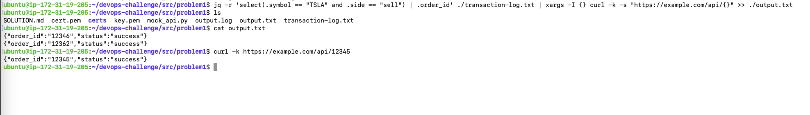

To achieve this solution, we need to set up a local DNS and a mock API server. The endpoint will be `https://example.com/api/:order_id`. This setup ensures that the endpoint is accessible locally.

### Setup:

1. **Setup Server**:
   - Use an x86 machine running Ubuntu 24.04.
   - (Picture will be provided later)
   

2. **Add Local DNS Entry**:
   - Edit the `/etc/hosts` file:
     ```sh
     sudo nano /etc/hosts
     ```
   - Add the following entry:
     ```plaintext
     127.0.0.1 example.com
     ```

3. **Generate Self-Signed SSL Certificate**:
   - Install OpenSSL:
     ```sh
     sudo apt install openssl -y
     ```
   - Create a directory for the certificates and generate them:
     ```sh
     mkdir ~/certs && cd ~/certs
     openssl req -x509 -newkey rsa:4096 -keyout key.pem -out cert.pem -days 365 -nodes
     ```

4. **Create a Mock API**:
   - Create a file named `mock_api.py` with the following content:
     ```python
     from flask import Flask, jsonify

     app = Flask(__name__)

     @app.route('/api/<order_id>', methods=['GET'])
     def get_order(order_id):
         return jsonify({"order_id": order_id, "status": "success"})

     if __name__ == '__main__':
         app.run(host='0.0.0.0', port=443, ssl_context=('./certs/cert.pem', './certs/key.pem'))
     ```

5. **Run the Mock API**:
   - Ensure Flask is installed on your machine:
     ```sh
     sudo apt install python3-flask -y
     ```
   - Run the mock API:
     ```sh
     sudo python3 mock_api.py
     ```

6. **Final Command**:
   - Use the following command to submit HTTP GET requests for order IDs selling TSLA and write the output to [output.txt](http://_vscodecontentref_/0):
     ```sh
     jq -r 'select(.symbol == "TSLA" and .side == "sell") | .order_id' ./transaction-log.txt | xargs -I {} curl -k -s "https://example.com/api/{}" >> ./output.txt
     ```

