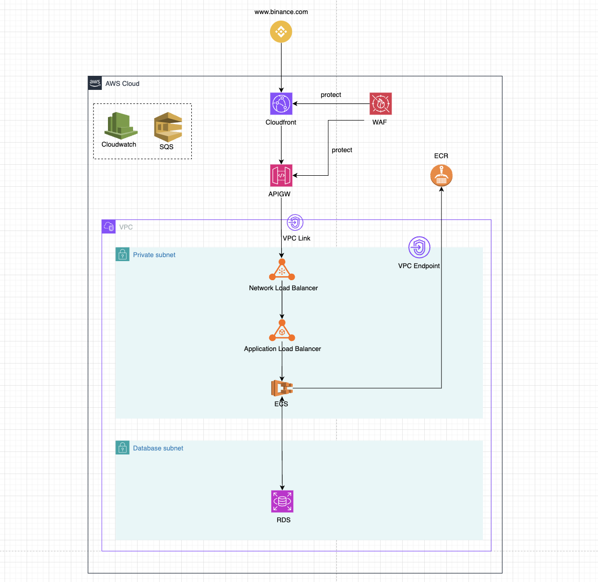

# **AWS High-Availability Trading System Architecture**

## **I. Architecture Overview**
The system is designed to be **highly available, scalable, and cost-effective**, leveraging **microservices, event-driven architecture, and AWS managed services**.

### **1. High-Level Flow**

---

## **2. Detailed Component Breakdown**

### **Frontend & API Layer**
| Service | Purpose |
|---------|---------|
| **Amazon CloudFront** | CDN for caching static content, reducing latency |
| **Amazon API Gateway (APIGW)** | Manages REST API and WebSocket API, request validation, rate limiting |
| **AWS WAF** | Protects CloudFront & API Gateway from attacks (DDoS, SQL Injection, Bot filtering) |

### **Networking & Load Balancing**
| Service | Purpose |
|---------|---------|
| **VPC Link** | Allows API Gateway to connect securely with private resources inside VPC |
| **Network Load Balancer (NLB)** | Routes requests to the ALB with low latency |
| **Application Load Balancer (ALB)** | Directs traffic to ECS microservices based on routing rules |
| **VPC Endpoint** | Enables ECS to pull images from ECR without internet access |

### **Compute & Containerization**
| Service | Purpose |
|---------|---------|
| **Amazon ECS (Fargate)** | Serverless container management for microservices |
| **Amazon ECR** | Stores container images |

### **Database & Storage**
| Service | Purpose |
|---------|---------|
| **Amazon RDS (Aurora PostgreSQL)** | Stores transactional data, supports replication for high availability |

### **Message Queue & Asynchronous Processing**
| Service | Purpose |
|---------|---------|
| **Amazon SQS** | Message queue for asynchronous task processing |

### **Monitoring & Logging**
| Service | Purpose |
|---------|---------|
| **Amazon CloudWatch** | Centralized logging, metrics, and alerting for all services |

---

## **II. Elaboration on why each cloud service is used and what are the alternatives considered.**

## **1. Frontend & API Layer**  

### **Amazon CloudFront (CDN)**
- **Why Used?**  
  - Reduces latency by caching static content closer to users.  
  - Provides DDoS protection with AWS Shield integration.  
  - Supports WebSockets for low-latency trading updates.  
- **Alternatives Considered:**  
  - **Fastly** (better real-time log streaming but more expensive).  
  - **Cloudflare** (strong DDoS protection but less AWS-native).  

### **Amazon API Gateway (APIGW)**
- **Why Used?**  
  - Manages REST/WebSocket APIs with built-in rate limiting.  
  - Works natively with AWS services (IAM, Lambda, VPC Link).  
  - Scales automatically without infrastructure management.  
- **Alternatives Considered:**  
  - **Kong Gateway** (self-managed, more control but complex).  
  - **NGINX API Gateway** (requires more manual scaling and configuration).  

### **AWS WAF (Web Application Firewall)**
- **Why Used?**  
  - Protects API Gateway and CloudFront from attacks (SQL injection, DDoS).  
  - Pre-built managed rules for common threats.  
- **Alternatives Considered:**  
  - **Cloudflare WAF** (better analytics but not AWS-native).  
  - **Imperva WAF** (better bot management but costly).  

---

## **2. Networking & Load Balancing**  

### **VPC Link**
- **Why Used?**  
  - Allows API Gateway to access private resources securely inside a VPC.  
- **Alternatives Considered:**  
  - **Directly exposing resources with public IPs** (less secure).  

### **Network Load Balancer (NLB)**
- **Why Used?**  
  - Low-latency TCP load balancing for high-throughput workloads.  
  - Supports WebSockets for real-time trading.  
- **Alternatives Considered:**  
  - **Application Load Balancer (ALB) alone** (ALB has higher latency for TCP).  
  - **HAProxy** (manual setup, lacks AWS integration).  

### **Application Load Balancer (ALB)**
- **Why Used?**  
  - Layer 7 routing to ECS microservices.  
  - Supports sticky sessions for user consistency.  
- **Alternatives Considered:**  
  - **Envoy Proxy** (better service mesh support but requires manual setup).  

### **VPC Endpoint**
- **Why Used?**  
  - Allows ECS to securely pull container images from ECR without an internet gateway.  
- **Alternatives Considered:**  
  - **NAT Gateway** (costlier for high egress traffic).  

---

## **3. Compute & Containerization**  

### **Amazon ECS (Fargate)**
- **Why Used?**  
  - Serverless container orchestration with auto-scaling.  
  - Reduces operational overhead compared to EC2-based clusters.  
- **Alternatives Considered:**  
  - **Amazon EKS (Kubernetes)** (better for complex microservices but requires more management).   

### **Amazon ECR (Elastic Container Registry)**
- **Why Used?**  
  - Fully managed container image registry with IAM-based access control.  
- **Alternatives Considered:**  
  - **Docker Hub** (public but has rate limits).  
  - **Harbor** (self-hosted, more control but harder to maintain).  

---

## **4. Database & Storage**  

### **Amazon RDS (Aurora PostgreSQL)**
- **Why Used?**  
  - Provides automatic replication, failover, and read scalability.  
  - Optimized for high-performance transactional workloads.  
- **Alternatives Considered:**  
  - **Amazon DynamoDB** (great for NoSQL but not ideal for relational transactions).  
  - **Self-managed PostgreSQL on EC2** (more control but requires ops effort).  

---

## **5. Message Queue & Asynchronous Processing**  

### **Amazon SQS**
- **Why Used?**  
  - Decouples microservices for scalability and fault tolerance.  
  - Automatically scales and retries failed messages.  
- **Alternatives Considered:**  
  - **Apache Kafka** (better for event streaming but more complex).  
  - **RabbitMQ** (better for advanced messaging patterns but needs EC2).  

---

## **6. Monitoring & Logging**  

### **Amazon CloudWatch**
- **Why Used?**  
  - Provides centralized logging, metrics, and automated alerts.  
  - Deep AWS integration (ECS, RDS, API Gateway).  
- **Alternatives Considered:**  
  - **Datadog** (better UI and integrations but expensive).  
  - **ELK Stack (Elasticsearch, Logstash, Kibana)** (open source, more flexible but requires management). 

# **III. Scaling Plans for Future Growth**

## **1. Load Balancing & High Availability**
- **Multi-AZ Deployment for ALB & NLB**  
  - Ensures high availability by distributing traffic across multiple Availability Zones.  
  - Protects against AZ failures for uninterrupted service.  

## **2. Compute & Auto-Scaling**
- **Auto Scaling Group (ASG) for ECS Fargate Tasks**  
  - Scales up/down based on CPU and memory usage.  
  - Ensures optimal resource utilization during peak trading hours.  

## **3. Database Scaling & Replication**
- **Multi-AZ Read-Replica for RDS (Aurora PostgreSQL)**  
  - Handles high read traffic by distributing queries across replicas.  
  - Automatic failover in case of primary database failure.  

- **Aurora Global Database (Future Expansion)**  
  - Enables cross-region replication for global trading markets.  
  - Reduces read latency for users in different geographies.  

## **4. Messaging & Event Processing**
- **SQS Scaling Automatically**  
  - Message queues scale elastically to handle increased microservices workload.  
  - Prevents bottlenecks during peak trading volumes.  

## **5. Caching for Performance Optimization**
- **Amazon ElastiCache (Redis) for API & DB Caching**  
  - Reduces load on RDS by caching frequently accessed queries.  
  - Improves API response times for market data 

## **6. Serverless Scaling**
- **API Gateway & CloudFront Auto-Scaling**  
  - API Gateway automatically scales to handle increased API requests.  
  - CloudFront caches content at edge locations to reduce backend load.  

## **7. Observability & Performance Optimization**
- **CloudWatch Auto-Scaling Alarms**  
  - Triggers scaling actions based on real-time traffic and resource usage.  
  - Ensures smooth user experience without performance degradation.  